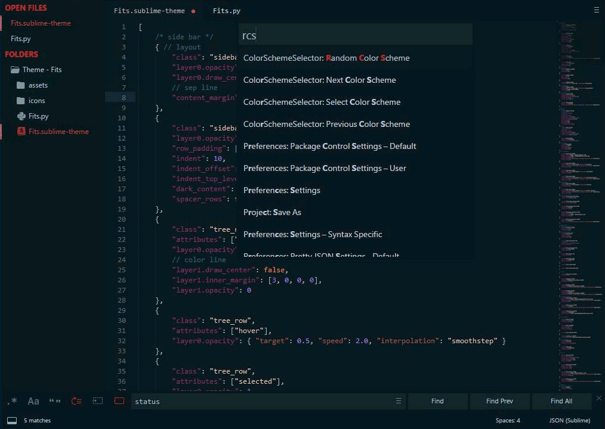

# Theme - Fits
A sublime text3 theme based on [SyncedSidebarBg](https://packagecontrol.io/packages/SyncedSidebarBg) that can automatic fits many(almost all) color schemes.

### Preview



Note that I use [ColorSchemeSelector](https://packagecontrol.io/packages/ColorSchemeSelector) to random select color scheme. 

### Features

- Flat UI
- Automatic change UI colors according to the color scheme you used
- Automatic fits light, medium and dark color schemes
- Side Bar will has uniform color icons，if you set **A File Icon** color to `#fff`, 

### Change Log

1.0.4:

[improve] more colorized

[add] some sep-line 

[add] bold tab label

[code] rewrite some python functions to enhance code readability and logicality

1.0.3:
[fix] A theme can't be activated properly bug, which is caused by moving a file from one window to another window.

### Install and Activate
1. Using **Package Control**: search "Theme - Fits" \
  or Download from [Github](https://github.com/xxxzc/themefits): 
  - open `Preferences -> Browse Packages...`
  - create new folder named `Theme - Fits`
  - download package and unzip into this folder

2. Add following code into `Preferences -> Settings - User`:
  ```json
  	"theme": "Fits.sublime-theme",
  ```

#### Issues

If your monitor scale is larger than 100% (like my win laptop is 2560x1440 resolution and I use 200% scale)

You can edit `Fits.sublime-theme` file: replace all `.png` with `@2x.png`, it may works.

### File Icons

I recommend you to use [A File Icon](https://packagecontrol.io/packages/A%20File%20Icon). 
And if you want to have uniform color in side bar, please add following code into `Preferences -> Package Settings -> A File Icon`:
```json
  "color": "#fff",
```

### Credits

Based on Theme - Default and  [SyncedSidebarBg](https://packagecontrol.io/packages/SyncedSidebarBg) by aziz.

Some assets are from [Spacegray](https://packagecontrol.io/packages/Theme%20-%20Spacegray).

### Contact me
if you have any idea or find bug, please let me know:
- Github: [Issues](https://github.com/xxxzc/themefits/issues)
- Gmail: xxxzcwork@gmail.com
